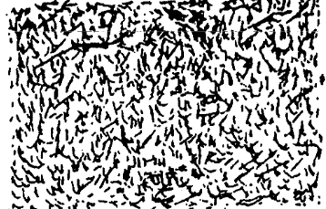
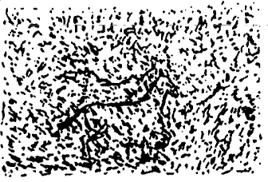

```{r setup, include=FALSE}
library(knitr)
knitr::opts_chunk$set(echo = FALSE)
```

## Modeling noise



- What can you see on this image?

## Modeling noise



- What can you see on this image?
- To what extenct you can be sure that there is something behind the noise?

## Analysis of variance

- ANOVA is behind most of the modern statistical methods
- Even very advanced statistical methods - like SEM - can be regarded as form of ANOVA

- Main goal of ANOVA is to divide randomness in the data, and assess to what excent the randomness can be modelled by data analyst

## Analysis of variance - null-model

```{r}
plot(density(mtcars$mpg,bw = 2), main = "")
```

## Analysis of variance - null-model

- Suppose you have collected as sample of N = 32 values of some variable

- Without any other information you can model such variable as:

- $y_{i} = \mu + \epsilon_{i}$
- $y_{i}$ is value of the variable for person $i$, for $i$ in $1,...,32$
- $\mu$ is the sample mean
- $\epsilon_{i}$ is deviance from the sample mean of a value for person $i$, for $i$ in $1,...,32$
- we usually call $\epsilon_{i}$ a residual

## Analysis of variance - total sum of squares

- we can use $\epsilon_{i}$ to calculate a sample variance, $\sigma^2$
- or TOTAL SUM OF SQUARES, $TSS = \sum_{i=1}^N \epsilon_{i}^2$

- the smaller the value of variance, the more we can be sure about conclusions we draw from the data
- hence our goal is to somehow minimize the variance in the data

## Analysis of variance - simple model

```{r}
plot(density(mtcars$mpg,bw = 2), main = "")
```

## Analysis of variance - simple model

```{r}
plot(density(mtcars[mtcars$gear==3,"mpg"],bw = 2), main = "", xlim=c(5,40), col="red")
lines(density(mtcars[mtcars$gear==4,"mpg"],bw = 2), col="green")
lines(density(mtcars[mtcars$gear==5,"mpg"],bw = 2), col="blue")
```

## Analysis of variance - simple model

- $y_{ij} = \mu + \alpha_j + \epsilon_{ij}$
- $\alpha_{j}$ is a deviance of group $j$ mean from a total sample mean, for $j$ in $1,...,3$
- $\epsilon_{ij}$ is deviance from the group mean of a value for person $i$ in group $j$
- we can use $\alpha_j$ to calculate MODEL SUM OF SQUARES, $MSS = \sum_{j=1}^K n_j*\alpha_{j}^2$, where $n_j$ is number of observations in group $j$
- moreover, we can use $\epsilon_{ij}$, to calculate RESIDUAL SUM OF SQUARE, $RSS = \sum_{j=1}^K \sum_{i=1}^{n} \epsilon_{ij}^2$

## F-ratio

- how can we compare variation assumed by model to residual variation
- so far we have MSS, and RSS, but the sizes we used to calculate this values differ
- we can eliminate this bias by dividing each value by respective value of degrees of freedom
- we then obtain MEAN SQUARES for model, $MS_M$, and RESIDUAL MEAN SQUARE, $MS_R$
- F-ratio is simply a ratio of $MS_M$ to $MS_R$, $F = \frac{MS_M}{MS_R}$

## ANOVA table

|             | Df|       SS|        MS|        F|       $p$|
|:------------|--:|--------:|---------:|--------:|---------:|
|Model        |  2| 483.24  | 241.62   | 10.90   | <0.001   |
|Residuals    | 29| 642.80  |  22.17   |         |          |

## What p-value actually means?

- Suppose that your model actually does not matter and expected value of our variable is the same across all groups
- Suppose that you have performed not one, but 1000 studies, where you collected a sample of the same size as in original one
- How frequently you should observe the value of F at least as big as the one you observed in your study?

- If p is less than some determined and well established value, e.g. 0.05, you can say that the results of your study are in some way remarkable
- You will probably reject null hypothesis, $H_0$ of no difference of means in favor of $H_1$
- You can also say, that your model is actually better that no model at all (null-model)

## How important is your model? - $\eta^2$

- Usually you should also answer how important is your model and how good it is in differentiating actual singal from noise

- One value you can use to obtain such information is to look at proportion of total variance explained by your model
- $\eta^2$ is a value you can use to estimate such proportion
- $\eta^2 = \frac{MSS}{TSS} = \frac{MSS}{MSS + RSS}$
